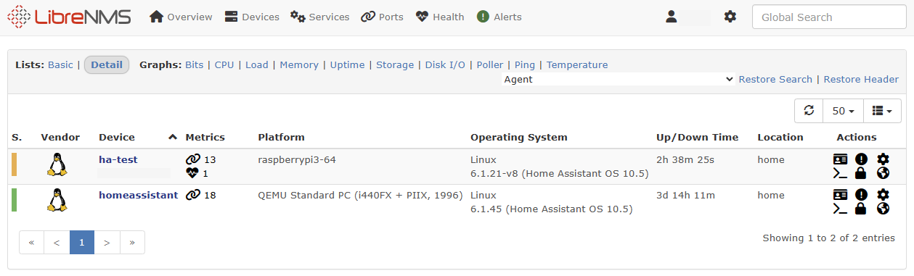

# SNMPD Home Assistant add-on

![Supports aarch64 Architecture][aarch64-shield] ![Supports amd64 Architecture][amd64-shield] ![Supports armhf Architecture][armhf-shield] ![Supports armv7 Architecture][armv7-shield] ![Supports i386 Architecture][i386-shield]

... to get your HA monitored via SNMP (_eq [librenms](https://www.librenms.org/) or [prtg](https://www.paessler.com/de/prtg/prtg-network-monitor)_).



Additional hass related information can be gathered via `NET-SNMP-EXTEND-MIB` - example

```shell
$ snmpwalk -v2c -c public my.ha.local NET-SNMP-EXTEND-MIB::nsExtendOutLine | grep hass_
NET-SNMP-EXTEND-MIB::nsExtendOutLine."hass_state".1 = STRING: running
NET-SNMP-EXTEND-MIB::nsExtendOutLine."hass_supported".1 = STRING: true
NET-SNMP-EXTEND-MIB::nsExtendOutLine."hass_docker_version".1 = STRING: 24.0.7
NET-SNMP-EXTEND-MIB::nsExtendOutLine."hass_hassos_version".1 = STRING: 11.3
NET-SNMP-EXTEND-MIB::nsExtendOutLine."hass_supervisor_version".1 = STRING: 2023.12.0
NET-SNMP-EXTEND-MIB::nsExtendOutLine."hass_homeassistant_version".1 = STRING: 2024.1.2
```

## How to use this repository

the easiest way is to use the following *my home assistant* link to add this repo as to your add-on store

[](https://my.home-assistant.io/redirect/supervisor_add_addon_repository/?repository_url=https%3A%2F%2Fgithub.com%2Fmib1185%2Fha-addon-snmpd)

Or navigate to **Settings** -> **Add-ons** -> **Add-on store** -> **3 dots top right corner** -> **Repositories** than add `https://github.com/mib1185/ha-addon-snmpd` as new repository.

---
You like my work?

<a href="https://www.buymeacoffee.com/mib1185" target="_blank"></a>

[aarch64-shield]: https://img.shields.io/badge/aarch64-yes-green.svg
[amd64-shield]: https://img.shields.io/badge/amd64-yes-green.svg
[armhf-shield]: https://img.shields.io/badge/armhf-yes-green.svg
[armv7-shield]: https://img.shields.io/badge/armv7-yes-green.svg
[i386-shield]: https://img.shields.io/badge/i386-yes-green.svg
